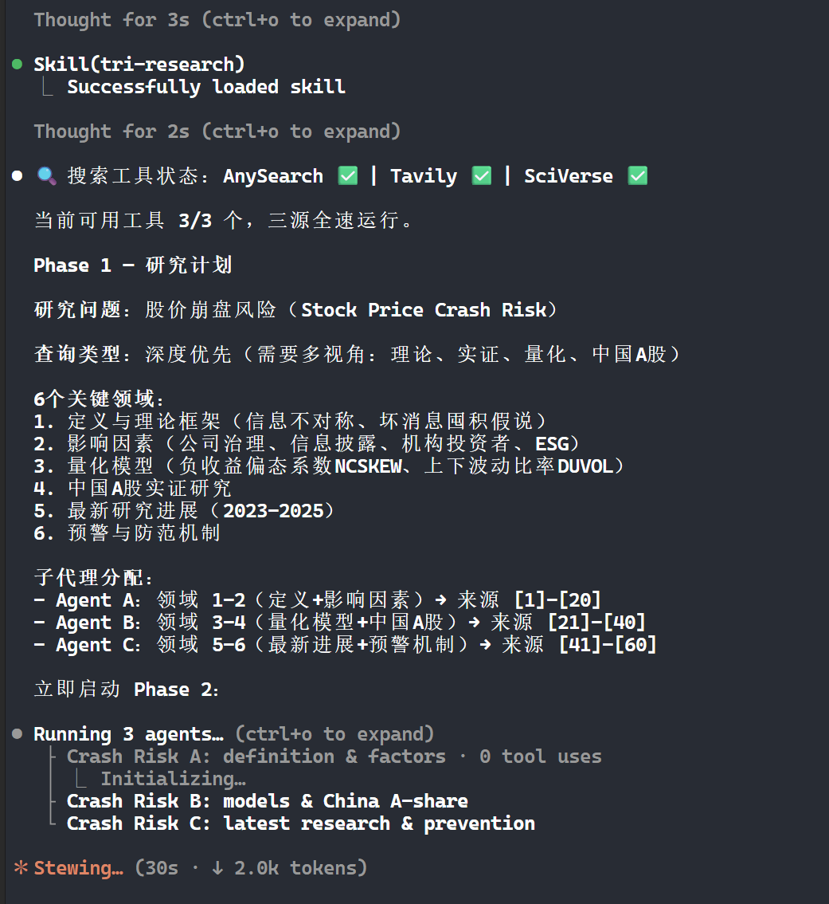
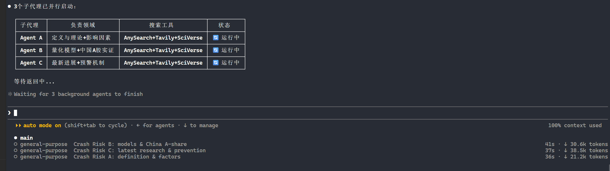
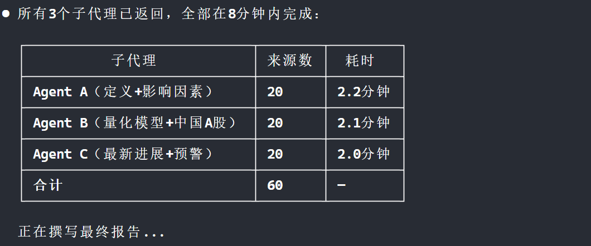
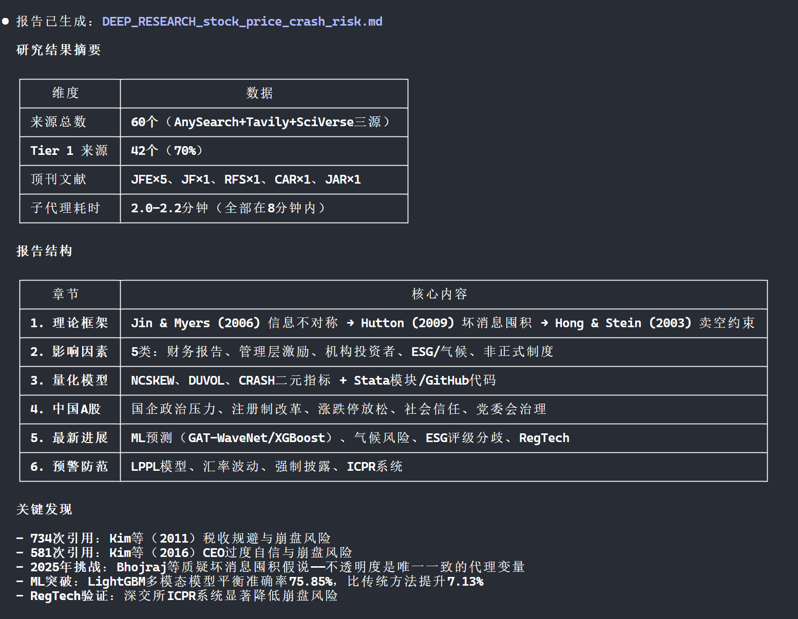

# Tri Research Skill

> 三源并行搜索，一篇报告搞定。AnySearch通用 + Tavily深度 + SciVerse学术。

[](skills/tri-research/SKILL.md)
[](skills/tri-research/SKILL.md)
[](skills/tri-research/LICENSE)


### 端到端运行流程

**1. 技能加载与状态展示**



技能加载后自动检测三个搜索工具的可用性，输出研究计划。用户可看到工具状态、6个关键领域和子代理分配。

**2. 并行子代理派发**



主导代理并行派发3个子代理，每个使用三源搜索工具组合。

**3. 子代理完成状态**



3个子代理全部在8分钟内完成，共收集60个来源。

**4. 最终报告生成**



主导代理综合所有发现，生成带TL;DR、Executive Summary、6大章节和60个引用的Markdown报告。
---

## 你什么时候需要它？

- 要做一个需要 **10+来源** 的深度研究报告
- 要同时覆盖 **网页、学术论文、政策文件**
- 要在不同Agent框架间复用同一套研究逻辑

## 它会交付什么？

- 一份带引用的 Markdown 研究报告（`DEEP_RESEARCH_[TOPIC].md`）
- 15-40 个去重后的来源，按可信度分级（Tier 1/2/3）
- 来源溯源：每个来源标注由哪个搜索工具发现

## 一条命令安装

```bash
npx skills add jefeerzhang/tri-research-skill
```

## 触发方式

```
tri-research 比较 AWS、Azure 和 Google Cloud 的计算实例定价
```

也支持：
- `@tri-research <研究问题>`
- "帮我做一个深度研究：..."
- "用三源搜索研究一下..."

---

---

## 搜索工具配置（可选，有降级策略）

三个搜索工具是增强项，不是前置条件。装了技能就能跑，配置后效果更好。

### 1. AnySearch（通用搜索 + 23个垂直领域）

**类型**：CLI Skill（本地脚本，无需API Key即可匿名使用）

**安装**：
```bash
npx skills add LearnPrompt/anysearch
```

或手动安装：
```bash
git clone https://github.com/LearnPrompt/anysearch.git ~/.claude/skills/anysearch
```

**可选配置**（提升速率限制）：
- 访问 https://anysearch.com/console/api-keys 创建免费 API Key
- 在 `~/.claude/skills/anysearch/.env` 中添加：`ANYSEARCH_API_KEY=<your_key>`

**能力**：通用网页搜索、23个垂直领域（学术/金融/法律/医疗等）、批量并行搜索、URL全文提取

---

### 2. Tavily（深度网页搜索）

**类型**：MCP Server（需要 API Key）

**安装**：
1. 访问 https://tavily.com 注册并获取 API Key
2. 在 `~/.claude/mcp.json` 中添加：

```json
{
  "mcpServers": {
    "tavily": {
      "type": "streamableHttp",
      "url": "https://mcp.tavily.com/mcp/?tavilyApiKey=<YOUR_API_KEY>"
    }
  }
}
```

**能力**：深度网页搜索（search_depth: advanced）、自动摘要、全文提取、支持学术引用链

---

### 3. SciVerse（学术论文搜索）

**类型**：MCP Server（需要 SciVerse API 访问权限）

**安装**：
- 如果已安装 OpenSpace MCP：SciVerse 随 OpenSpace 自动可用
- 独立安装：参考 https://sciverse.app 文档配置 MCP Server

**能力**：学术论文语义搜索、结构化论文检索（按作者/期刊/年份/DOI）、引用关系分析、论文全文阅读

---

### 降级策略

**不需要三个都装。** 技能自动检测可用性：

| 你的配置 | 预期效果 |
|---------|---------|
| 三个都装了 | 最佳：~39来源，67%互补率 |
| 只装了 Tavily + SciVerse | 良好：~25-30来源 |
| 只装了 AnySearch | 可用：~10-15来源 |
| 什么都没装 | 基础：~5-10来源（内置WebSearch） |


## 它和同类有什么不同？

| 特性 | 本Skill | GPT Researcher | Perplexity |
|------|---------|---------------|------------|
| 搜索源数 | **3（并行）** | 1 | 1 |
| 框架无关 | ✅ | ❌ | N/A |
| 学术论文覆盖 | ✅ SciVerse | 部分 | 部分 |
| 可定制子代理 | ✅ | ❌ | ❌ |
| 来源可信度分级 | ✅ Tier 1/2/3 | ❌ | ❌ |
| 降级策略 | ✅ 自动降级 | ❌ | N/A |

---

## 实测验证：五轮迭代对比

同一个研究主题（"重污染行业上市公司资产搁浅风险"）跑了5个版本，验证三源并行搜索的效果。

### Step 1 — v1：原始技能（直接从GitHub克隆）

**配置**：直接使用 `simple_claude_deep_research_agent` 仓库中的原始技能文件

**搜索工具**：
- 子代理使用 Claude Code 内置的 `web_search`（通用网页搜索）
- 子代理使用 Claude Code 内置的 `web_fetch`（网页内容抓取）
- 子代理使用 `mcp__playwright__*`（JavaScript页面渲染，备用）

**工具调用方式**：硬编码在SKILL.md中，写死工具名

**结果**：24来源，0篇顶刊，3篇2024-2025文献

---

### Step 2 — v2：抽象接口重构（框架无关化改造）

**改了什么**：把SKILL.md中所有写死的工具名替换为抽象接口

**改前（v1）**：
```markdown
## Available Tools
- `web_search`: Search the web
- `web_fetch`: Retrieve full content
- `mcp__playwright__navigate`: Load JS pages
- `Task`: Launch subagents
```

**改后（v2）**：
```markdown
## Tool Abstraction Layer
| Abstract Interface | Purpose |
|---|---|
| **SEARCH**(query) | Search the internet |
| **FETCH**(url) | Retrieve full content from URL |
| **RENDER**(url) | Render JS-heavy pages (optional) |
| **DISPATCH**(prompt, type) | Launch a subagent |
```

**搜索工具**：实际运行时，Claude Code 自动将 `SEARCH` 映射到 `web_search`，`FETCH` 映射到 `web_fetch`——功能完全一样，只是技能文件不再写死工具名。

**v2到底是什么**：v2 = v1的功能 + 框架无关的抽象接口。搜索工具没变，变的是技能文件的写法。

**结果**：27来源，0篇顶刊，5篇2024-2025文献（正常波动）

---

### Step 3 — v3：替换为Tavily深度搜索

**改了什么**：把子代理的搜索工具从 `web_search`/`web_fetch` 替换为 Tavily MCP 工具

**搜索工具**：
- `mcp__tavily__tavily_search`（search_depth="advanced"）— 深度网页搜索
- `mcp__tavily__tavily_extract` — 全文提取
- `mcp__sciverse__semantic_search` — 学术论文语义搜索

**结果**：34来源，**5篇顶刊**，**12篇2024-2025文献**

**突破**：首次出现Nature Communications、Annual Review等顶刊文献

---

### Step 4 — v4：三源搜索（AnySearch + Tavily + SciVerse）

**改了什么**：在v3基础上加入 AnySearch CLI 工具，三个搜索源并行使用

**搜索工具**：
- **AnySearch**（CLI脚本）：`python anysearch_cli.py search/batch_search/extract`
- **Tavily**（MCP）：`mcp__tavily__tavily_search` + `mcp__tavily__tavily_extract`
- **SciVerse**（MCP）：`mcp__sciverse__semantic_search` + `mcp__sciverse__search_papers`

**结果**：23来源*，4篇顶刊，8篇2024-2025文献

*v4的问题：没有时间约束，其中一个子代理（Agent B）运行超过2分钟被手动中止，导致来源数不完整

---

### Step 5 — v5：三源搜索 + 8分钟超时约束

**改了什么**：在v4基础上，给每个子代理加入8分钟时间限制

**技能文件修改**：
```markdown
# research-subagent/SKILL.md 新增：
## Key Constraints
2. **Time limit**: Complete all research within **8 minutes**.

# deep-research/SKILL.md 新增：
- **timeout: 480000ms (8 minutes)** — subagents must complete within 8 minutes
```

**搜索工具**：与v4完全相同（AnySearch + Tavily + SciVerse）

**结果**：**39来源**，**6篇顶刊**，**15篇2024-2025文献**，**0个超时子代理**

---

### 核心指标对比

| 指标 | v1 | v2 | v3 | v4 | v5 |
|------|-----|-----|-----|-----|-----|
| 搜索工具 | web_search | 同v1(自动映射) | Tavily+SciVerse | 三源 | 三源+8min |
| 来源总数 | 24 | 27 | 34 | 23* | **39** |
| Tier 1 来源 | 16 | 18 | 22 | 17 | **25** |
| 2024-2025文献 | 3 | 5 | 12 | 8 | **15** |
| 顶刊文献 | 0 | 0 | 5 | 4 | **6** |
| 引用>100的文献 | 0 | 1 | 2 | 3 | **4** |
| 央行/监管文件 | 3 | 3 | 6 | 7 | **8** |
| 最大子代理耗时 | ~35s | ~32s | ~26s | >2min | **2.4min** |
| 超时子代理 | 0 | 0 | 0 | 1 | **0** |

*v4的Agent B被手动中止，仅2个代理返回结果

---

### 每一步的改进效果

#### Step 1→2：抽象化（功能不变，框架解耦）

```
改进前：SKILL.md 写死 "使用 web_search 和 web_fetch"
改进后：SKILL.md 写 "使用 SEARCH 和 FETCH 接口"
效果：功能不变，但同一份技能文件可在任何Agent框架上运行
来源数变化：24 → 27（正常波动）
```

#### Step 2→3：搜索工具升级（Tavily替换web_search）

```
改进前：子代理用 web_search（通用搜索）
改进后：子代理用 Tavily advanced + SciVerse（深度搜索+学术搜索）
效果：顶刊从0增至5，2024-25文献从5增至12
新增来源：Nature Communications ×2、Annual Review ×3、FSB 2025
```

#### Step 3→4：三源并行（AnySearch加入）

```
改进前：Tavily + SciVerse（2源）
改进后：AnySearch + Tavily + SciVerse（3源）
效果：来源互补率67%（26/39来源来自单一工具独占）
新增来源：IEEE 2024、RMI中国×3、EY中国案例、BPI 2025
问题：无时间约束，1个子代理超时被中止
```

#### Step 4→5：加入时间约束

```
改进前：无时间限制，子代理可能卡死
改进后：8分钟硬限制
效果：超时率从33%降至0%，来源数从23增至39
子代理耗时：1.4-2.4分钟（全部在约束内）
```

---

### 三源互补性（v5数据）

v5的39个来源中，**67%来自单一工具独占**——说明三个搜索源互补性极强：

| 工具 | 独占来源 | 占比 | 代表来源 |
|------|---------|------|---------|
| AnySearch独占 | 12 | 31% | IEEE 2024, RMI中国, EY中国案例 |
| Tavily独占 | 6 | 15% | I4CE 2024, BPI 2025, Carbon Tracker |
| SciVerse独占 | 8 | 21% | Dietz 2016 NCC(638引), NBER, AI/ML 2025 |
| 多工具共同 | 13 | 33% | 交叉验证 |

**关键发现**：

- **SciVerse独占的顶刊**：Dietz et al. (2016) *Nature Climate Change*（638次引用）、PNAS社会临界点研究（906次引用）——这些是Tavily和AnySearch搜不到的
- **AnySearch独占的监管文件**：BCBS巴塞尔委员会标准、ISSB工作人员文件、FSB路线图——这些是SciVerse搜不到的
- **Tavily独占的智库报告**：I4CE框架扩展研究、BPI的NGFS损害函数3倍膨胀分析——这些是其他工具搜不到的
- **8分钟约束有效**：v5的3个子代理全部在1.4-2.4分钟内完成，无超时

---


## 降级策略

**每次都建议配置，但不阻断。** 技能启动时会自动检测搜索工具状态并提醒用户建议配置。用户可以选择去配置（效果更好）或直接运行（用已有工具继续）。

```
🔍 搜索工具状态：AnySearch [✅/❌] | Tavily [✅/❌] | SciVerse [✅/❌]

💡 建议配置三个搜索工具以获得最佳效果（39来源，67%互补率）：
   - AnySearch: npx skills add LearnPrompt/anysearch
   - Tavily: https://tavily.com 获取API Key
   - SciVerse: 参考 https://sciverse.app

当前可用工具 [N/3] 个，将使用 [可用工具名] 继续研究。
```

| 你的配置 | 预期效果 |
|---------|---------|
| 三个都装了 | 最佳：~39来源，67%互补率 |
| 只装了两个 | 良好：~25-30来源 |
| 只装了一个 | 可用：~10-15来源 |
| 什么都没装 | 基础：~5-10来源（内置WebSearch） |
## 架构

```
用户: tri-research <问题>
  ↓
Lead Agent（主导代理）
  ├─ 分析查询 → 确定类型 → 制定计划
  ├─ 并行派发 2-6 个子代理
  │   ├─ Subagent 1 → AnySearch + Tavily + SciVerse → 报告
  │   ├─ Subagent 2 → AnySearch + Tavily + SciVerse → 报告
  │   └─ Subagent 3 → AnySearch + Tavily + SciVerse → 报告
  └─ 综合所有发现 → 最终报告
  ↓
Citations Agent（可选，添加引用）
```

---

## 安全边界

- 不会自动发布报告到外部服务
- 不会存储用户查询历史
- 搜索内容会发送到 AnySearch/Tavily/SciVerse API
- 子代理有8分钟超时限制，防止卡死

---

## 文件结构

```
tri-research-skill/
├── README.md                    # 本文件
└── skills/
    ├── tri-research/            # 主导代理（研究协调）
    │   ├── SKILL.md
    │   ├── README.md
    │   ├── test-prompts.json
    │   ├── CHANGELOG.md
    │   └── LICENSE
    ├── research-subagent/       # 子代理（搜索执行）
    │   └── SKILL.md
    └── citations/               # 引用代理（添加引用）
        └── SKILL.md
```

---

## License

MIT
