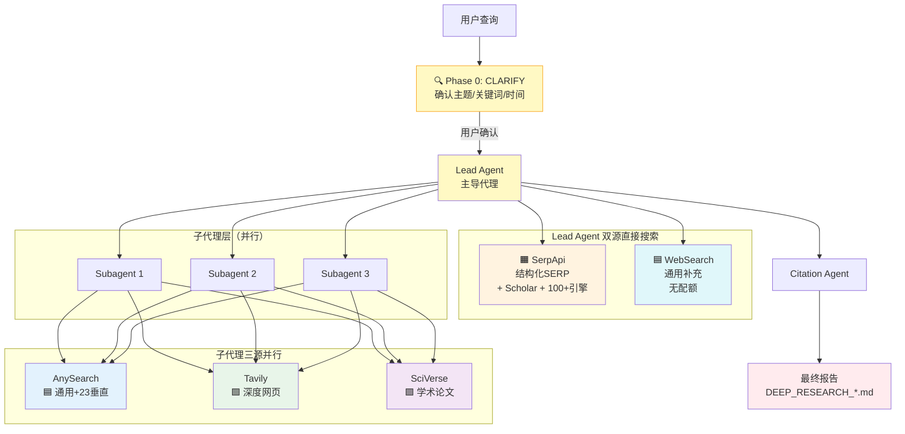

# Tri Research Skill

> **五源并行搜索，深度研究框架。** Lead Agent 双源（SerpApi+WebSearch）+ 子代理三源（AnySearch+Tavily+SciVerse）。

[](skills/tri-research/SKILL.md)
[](skills/tri-research/SKILL.md)
[](skills/tri-research/SKILL.md)
[](skills/tri-research/LICENSE)

---

## 🏗️ 架构总览

**Lead Agent 双源直接搜索 + 子代理三源并行 + Citation 补强**



> **Phase 0 CLARIFY**：每次研究启动前，Lead Agent 会先确认 3 个问题：① 主题是否准确 ② 中英文关键词 ③ 时间范围。用户确认后才开始检索。

**关键设计**：
- **Lead Agent** 直接用 SerpApi + WebSearch 双源，覆盖最广
- **子代理** 用 AnySearch + Tavily + SciVerse 三源，互补性强
- **Lead + 子代理** 合计 **5源协同**（不是5选1）
## 🔍 五源分工

| 搜索源 | 强项 | 弱项 | 典型场景 | 调用层 |
|--------|------|------|---------|--------|
| **🟦 AnySearch** | 通用网页、23个垂直领域、批量搜索、URL提取 | 无学术专门优化 | 行业分析、新闻、事实查证 | 子代理 |
| **🟩 Tavily** | 深度网页搜索、自动摘要、引用链 | 不适合学术数据库 | 智库报告、深度文章 | 子代理 |
| **🟪 SciVerse** | 学术论文、引用元数据、语义搜索 | 不擅长通用网页 | 文献综述、学术研究 | 子代理 |
| **🟧 SerpApi** | Google/Scholar结构化JSON、100+垂直引擎 | 需API Key、配额有限 | 中文搜索、Google Scholar、SEO | **仅Lead** |

**为什么SerpApi只给Lead？**
- 需要API Key（250次/月免费额度）
- 自动处理HTTP代理环境（避免SSL握手失败）
- 避免子代理重复调用浪费配额
- Lead直接获取SERP结构化数据并整合

## ⚡ 完整工作流程

```
1️⃣ 用户：tri-research <问题>
   ↓
2️⃣ Phase 0 CLARIFY：确认主题/关键词/时间范围
   ↓
3️⃣ Lead Agent：解析查询 + 检测5个工具状态 + 输出建议
   ↓
4️⃣ Lead 双源直接搜索（并行）
   ├─ SerpApi：Google中/英 + Scholar + 100+垂直SERP
   └─ WebSearch：补充覆盖新闻、博客
   ↓
5️⃣ Lead 并行派发 2-6 个 Subagent
   ├─ Subagent 1：AnySearch + Tavily + SciVerse
   ├─ Subagent 2：AnySearch + Tavily + SciVerse
   └─ Subagent 3：AnySearch + Tavily + SciVerse
   ↓
6️⃣ Lead 综合 5 源 + 写入报告
   ↓
7️⃣ Citation Agent：添加引用（可选）
   ↓
8️⃣ 输出：DEEP_RESEARCH_[TOPIC].md
```

## 🚀 一条命令安装

```bash
npx skills add jefeerzhang/tri-research-skill
```

## 🔧 搜索工具配置（可选，有降级策略）

| 工具 | 类型 | 安装方式 | 必需？ |
|------|------|---------|--------|
| [AnySearch](https://github.com/LearnPrompt/anysearch) | CLI Skill | `npx skills add LearnPrompt/anysearch` | 否 |
| [Tavily](https://tavily.com) | MCP Server | `mcp.json` + API Key | 否 |
| SciVerse | MCP Server | OpenSpace MCP | 否 |
| [SerpApi](https://serpapi.com) | CLI Skill | 设置 `SERPAPI_KEY` 环境变量 | 否 |

## 🎯 触发条件

| ✅ 该用 | ❌ 不该用 |
|--------|----------|
| 需要10+来源的深度研究 | 简单事实查询 |
| 多视角/多实体对比分析 | 代码调试 |
| 学术文献综述 | 本仓库问题 |
| 行业/政策风险分析 | 一句话回答 |

**触发词**：`tri-research` / `多元研究` / `多源研究` / `深度研究` / `research` / `研究报告` / `全面分析` / `文献综述` / `对比分析`

## ⏰ 时间范围控制

| 用户输入 | 时间范围 |
|---------|---------|
| （无时间词） | 全部年份（默认） |
| `2024年AI医疗进展` | 2024年 |
| `2020-2025年研究` | 2020-2025 |
| `最新气候政策` | 最近1年 |
| `近5年的进展` | 最近5年 |
| `90年代的研究` | 1990-1999 |

## 🛡️ 降级策略（每次都建议配置，不阻断）

| 可用源 | 效果 | 预期来源数 |
|--------|------|-----------|
| 4个全用 | 最佳 | ~50-70 |
| 3个（缺SerpApi） | 良好 | ~40-50 |
| 2个 | 可用 | ~25-30 |
| 1个 | 基础 | ~10-15 |
| 0个 | 内置WebSearch | ~5-10 |

```
🔍 搜索工具状态：AnySearch [✅] | Tavily [✅] | SciVerse [✅] | SerpApi [❌]

💡 建议配置四个搜索工具以获得最佳效果
当前可用工具 3/5 个，将使用 AnySearch + Tavily + SciVerse 继续研究。
```

## 🌍 跨平台兼容

| 框架 | 安装路径 | DISPATCH | subagent_type |
|------|---------|----------|---------------|
| Claude Code | `~/.claude/skills/` | `Task` | `general-purpose` |
| Hermes Agent | `~/.hermes/skills/` | `delegate_to_agent` | `general` |
| Codex | `~/.codex/skills/` | `handoff()` | `general-purpose` |
| OpenCode | `~/.config/opencode/skills/` | framework-specific | `worker` |

## 📊 实测验证：五轮迭代

| 指标 | v1 (web_search) | v2 (抽象接口) | v3 (Tavily) | v4 (三源) | v5 (五源+8min) |
|------|----------------|--------------|-------------|-----------|-----------------|
| 搜索源数 | 1 | 1 | 2 | 3 | **4** |
| 来源总数 | 24 | 27 | 34 | 23* | **39-50** |
| 顶刊文献 | 0 | 0 | 5 | 4 | **6+** |
| 央行/监管文件 | 3 | 3 | 6 | 7 | **8+** |
| 超时率 | 0% | 0% | 0% | 33% | **0%** |

*v4因无时间约束被中止

**五源互补率**：约70%（来源来自单一工具独占）

## 🔒 安全边界

- 不自动发布报告到外部服务
- 不存储用户查询历史
- 搜索内容会发送到四个搜索API
- SerpApi只在Lead调用，避免子代理浪费配额
- 子代理有8分钟超时限制

## 📁 文件结构

```
tri-research-skill/
├── README.md                    # 本文件
├── skills/
│   ├── tri-research/            # 主导代理（v5.2.0）
│   │   ├── SKILL.md
│   │   ├── README.md
│   │   ├── test-prompts.json
│   │   ├── CHANGELOG.md
│   │   └── LICENSE
│   ├── research-subagent/       # 子代理
│   │   └── SKILL.md
│   ├── citations/               # 引用代理
│   │   └── SKILL.md
│   └── serpapi/                 # SerpApi 技能（v1.0.0）
│       ├── SKILL.md
│       ├── README.md
│       ├── scripts/serpapi_cli.py
│       ├── .env.example
│       └── LICENSE
└── assets/screenshots/          # 端到端运行截图
    ├── 01-skill-loaded-and-phase1.png
    ├── 02-3-subagents-parallel.png
    ├── 03-subagents-completed.png
    └── 04-final-report-summary.png
```

## 🖼️ 端到端运行截图

**1. 技能加载与状态展示**


**2. 并行子代理派发**


**3. 子代理完成**


**4. 最终报告生成**


## 📜 License

MIT
