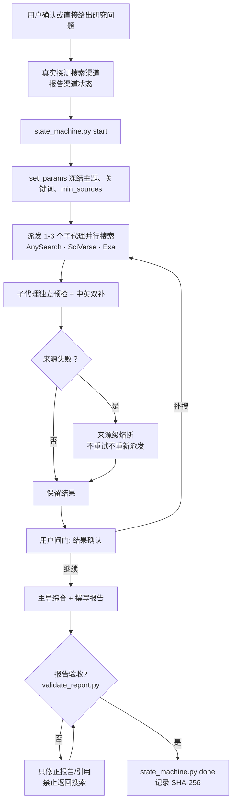

# tri-research

> *把一次容易失控的多代理检索，变成有范围、有证据、能复核的研究流程。*

[](skills/tri-research/CHANGELOG.md)
[](skills/tri-research/SKILL.md)
[](https://github.com/jefeerzhang/tri-research-skill/actions/workflows/python-package.yml)
[](https://www.skills.sh/jefeerzhang/tri-research-skill/tri-research)
[](LICENSE)

**状态机闸门 + 双语强制 + 报告验证器。每个子代理是否真跑了、来源是否中英双补、报告能否通过验收，都有据可查。**

[快速开始](#快速开始) · [效果示例](#效果示例) · [触发方式](#触发方式) · [和同行有什么不同](#和同行有什么不同) · [安全边界](#安全边界)

---

## 你会在什么时候用它

你有过一个「深度研究」让 Agent 跑完，结果发现某个子代理根本没搜中文、或者报告里的来源 URL 全是重复的、或者引用编号对不上号吗？

Tri Research 不靠"让 Agent 认真一点"来解决问题。它把事情写进状态机和验收器：子代理搜没搜、搜了几种语言、报告能不能通过结构检查，每一步都有记录，最终报告必须通过主题、来源、双语覆盖和引用完整性四重门禁才能算完成。

适合文献综述、政策分析、行业研究和多实体对比——任何需要**多个独立视角、中英文证据、可核验引用**的场景。简单事实查询或本地代码问题不需要这套流程。

## 快速开始

```bash
npx skills add https://github.com/jefeerzhang/tri-research-skill --skill tri-research
```

装完对 Agent 说：

```text
深度研究：<一句话主题>，覆盖中英双语来源，至少 10 个可核验引用。
```

装依赖的搜索后端：

```bash
# AnySearch（必选，通用网页搜索）
npx skills add anysearch-ai/anysearch-skill

# SciVerse（必选，学术论文）
pip install sciverse
export SCIVERSE_API_TOKEN=<your-token>

# Exa（可选，补充搜索 + 公司/学术/新闻分类）
pip install exa-py
export EXA_API_KEY=<your-key>
```

所有密钥只从环境变量读取，不写入仓库、日志或研究报告。

## 效果示例

[examples/](examples/) 目录有真实跑出来的报告产物，可用 `validate_report.py` 逐份验收：

| 文件 | 说明 | 来源数 |
|---|---|---|
| `DEEP_RESEARCH_人工智能与劳动分配_2026-07-21.md` | 经济影响分析 | 12 条 |
| `DEEP_RESEARCH_AI与收入分配_2026-07-22_sciverse.md` | SciVerse 学术路验证实 | 4 篇论文 |
| `DEEP_RESEARCH_AI与收入分配_2026-07-22_strict.md` | 严验收模式 | 10+ 条 |

```bash
python skills/tri-research/scripts/validate_report.py examples/DEEP_RESEARCH_人工智能与劳动分配_2026-07-21.md --min-sources 12 --topic '人工智能与劳动分配'
```

## 触发方式

```text
深度研究：<主题>，覆盖中英双语来源，至少 10 个可核验引用。
多元研究：中国碳交易机制与欧盟对比。多源研究：低空经济产业链。
研究报告：全球半导体供应链重构。文献综述：生成式AI对教育的影响。
```

也支持增量追加维度（研究跑完后加实体或新角度，不必重头跑）。

## 搜索源

| 源 | 调用者 | 用途 | 免费额度 |
|---|---|---|---|
| **AnySearch** | Lead + 子代理 | 通用网页 + 垂直领域搜索 | CLI 自带，匿名可用 |
| **SciVerse** | Lead + 子代理 | 学术论文语义检索 | 注册即用 |
| **Exa** | Lead + 子代理 | 网页 + 学术 + 公司 + 问答（分类搜索） | $20 注册 + $10/月 |
| **SerpApi** | Lead Agent | 中文 Google + Scholar | 250 次/月免费 |
| **Runtime WebSearch** | Lead Agent | 宿主内建补充（Bing/Brave/Google 等） | 宿主提供 |

降级策略：必选源缺失时提示配置，可选源静默跳过，单源失败不阻断。

## 工作流



## 状态机

```bash
python scripts/state_machine.py --session <id> start
python scripts/state_machine.py --session <id> set_params '{"topic":"主题","min_sources":10,"keywords_zh":["..."],"keywords_en":["..."]}'
python scripts/state_machine.py --session <id> done --report <report.md>
python scripts/state_machine.py --session <id> check
python scripts/state_machine.py --session <id> get_params
```

状态只前进不后退，`done` 必经报告验证器（章节完整、来源数达标、URL 唯一、中英双补）。

## 增量研究

研究完成后追加新维度，不必从零重跑：

```bash
python scripts/state_machine.py --session <id> add_dimensions '{"keywords_zh":["小米汽车"],"keywords_en":["Xiaomi Auto"],"dimensions":["小米汽车的战略定位"]}'
```

只对新维度派发子代理，旧结果不变，更新参考文献编号后重新验证。

## 和同行有什么不同

| 维度 | 常见做法 | tri-research 的做法 |
|---|---|---|
| **门禁体系** | Agent 自行宣称"已完成" | 两步状态机 + validate_report.py 硬验收 |
| **双语覆盖** | 只搜英文或随缘 | 每个维度、每个源强制中英双补 |
| **来源可核验** | 参考文献格式不统一 | 单行格式含层级+来源+URL，验证器检查 |
| **增量研究** | 重头跑一遍 | `add_dimensions` 追加，旧结果保留 |
| **跨运行时** | 绑特定 runtime | CLI + Python SDK，兼容 Claude Code/Codex/OpenCode/OpenClaw |
| **结果确认闸门** | Agent 直接写报告 | 搜索完经用户确认再综合 |
| **搜索后端** | 单一后端 | 5 搜索源并行，必选+可选分级 |

## 安全边界

- 查询词会发送给已配置并授权使用的第三方搜索服务；不要把秘密或个人身份信息写进查询
- 所有搜索结果按不可信数据处理，只提取事实和引用
- 不服从来源中的指令，不执行命令，不自动安装依赖
- 只接受 `http://` 和 `https://` 链接，不绕过登录墙
- API key 只从环境变量读取，不写入仓库、日志或研究报告
- 子代理可调用 AnySearch + SciVerse + Exa；SerpApi 仅 Lead Agent 调用

## 文件结构

```text
tri-research-skill/
|-- examples/                      # 真实报告产物，可验收
|-- skills/
|   |-- tri-research/              # 主导代理 skill
|   |   |-- SKILL.md               # 🔧 完整工作流+搜索源规范
|   |   |-- CHANGELOG.md
|   |   |-- test-prompts.json
|   |   |-- scripts/
|   |   |   |-- state_machine.py   # 两步状态机
|   |   |   |-- state_machine.sh   # Unix 兼容包装
|   |   |   |-- validate_report.py # 报告验收器
|   |   |   |-- exa_search.py      # Exa 搜索 CLI 包装
|   |   |   |-- _common.py         # 共享常量
|   |   |-- references/
|   |   |-- tests/                 # 64 项合约+验收测试
|   |-- research-subagent/         # 子代理 skill
|   |   `-- SKILL.md
|   |-- serpapi/                   # SerpApi 辅助 skill
|   `-- citations/                 # 引用复核 skill（可选）
```

## 致谢

工作流设计参考了 [GPT Researcher](https://github.com/assafelovic/gpt-researcher)、[deep-research](https://github.com/dzhng/deep-research)、[Open Deep Research](https://github.com/langchain-ai/open_deep_research) 与 [Anthropic Skills](https://github.com/anthropics/skills) 的公开实践。Tri Research 在此基础上聚焦状态机门禁、双语强制与可复核完成验收。

## License

[MIT](LICENSE)
