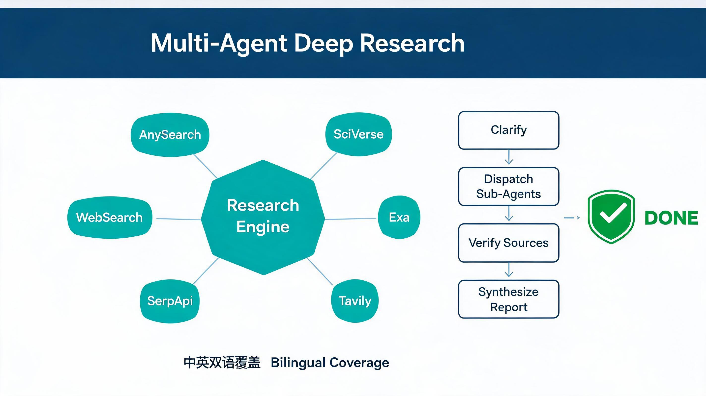
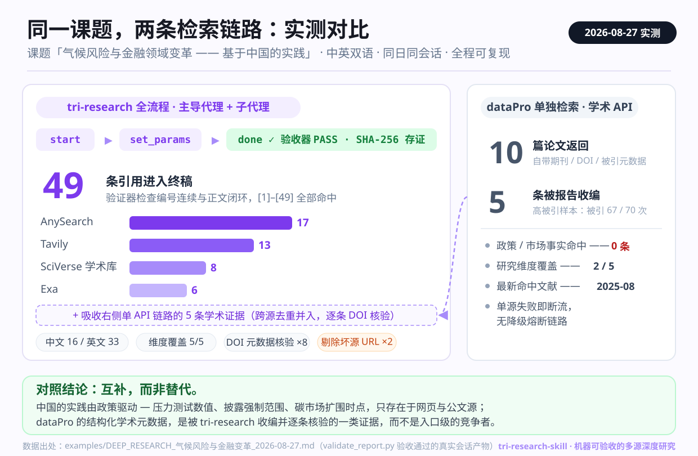
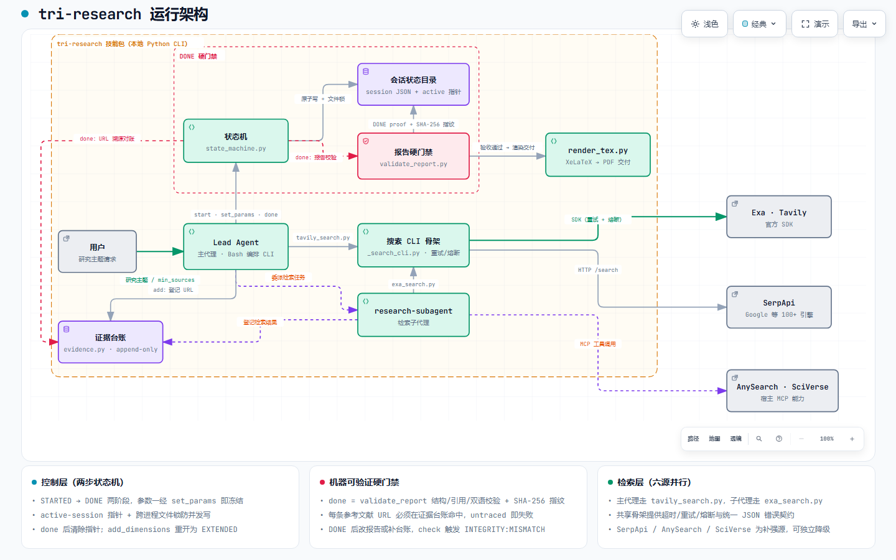

# tri-research

> 把一次容易失控的多代理检索，变成有范围、有证据、能复核的研究流程。

[](skills/tri-research/CHANGELOG.md)
[](skills/tri-research/SKILL.md)
[](https://github.com/jefeerzhang/tri-research-skill/actions/workflows/python-package.yml)
[](https://www.skills.sh/jefeerzhang/tri-research-skill/tri-research)
[](LICENSE)

Tri Research 是一个多代理深度研究技能（Agent Skill）。它不靠「让 Agent 认真一点」来保证质量，而是把**可机器检查**的完成标准写进状态机和验收器：最终报告必须通过主题、来源数量、报告级双语覆盖和引用完整性等**硬门禁**，才能进入完成状态（`DONE`）。检索过程中的质量门、来源核验、红队等是推荐流程——提高证据质量，但不假装已被代码强制。



**实测战果**——同一课题、同一天、同一会话，tri-research 全流程 vs 单一学术 API 直查（课题：气候风险与金融领域变革·中国实践）：



<sub>▲ 49 条引用全部通过 <code>validate_report.py</code> 验收，每个数字可在 <a href="examples/DEEP_RESEARCH_气候风险与金融变革_2026-08-27.md">真实会话产物</a>中查证</sub>

[快速开始](#快速开始) · [核心亮点](#核心亮点) · [运行架构](#运行架构) · [什么时候用它](#什么时候用它) · [效果示例](#效果示例) · [状态机](#状态机) · [和同行有什么不同](#和同行有什么不同)

---

## 核心亮点

- **机器验收，而非自我宣称**：两步状态机 + 报告验证器（`validate_report.py`），不满足硬门禁就无法 `DONE`，报告结构、引用闭环与完成哈希都可机器复核
- **中英双语强制覆盖**：每个研究维度都要求中文 + 英文证据，验收器会做报告级双语检查，杜绝「只搜英文」的偷懒
- **六源并行检索**：AnySearch / Tavily / SciVerse / Exa / SerpApi / Runtime WebSearch，按必选与可选分级，单个源失败不阻断研究
- **来源可核验**：每条参考文献带层级、来源与唯一 URL，格式统一；学术来源支持按 DOI 逐条核对
- **引用溯源台账**：每波搜索的 URL 及其出处（源 + query）记入会话级 append-only 台账；`done` 硬门禁逐条对账，报告里的每条引用都必须能回答「在哪次搜索见过」
- **增量研究**：研究完成后可追加新维度，只检索增量部分，旧结果原样保留
- **LaTeX/PDF 交付**：报告一键渲成书样 PDF（自动跳过 drawio 框架图），md 仍为唯一真源
- **跨运行时**：基于 Python CLI + SDK，兼容 Claude Code / Codex / OpenCode / OpenClaw

## 运行架构



运行时组件与硬门禁链路：Lead Agent 编排两步状态机（STARTED → DONE），检索层经共享 CLI 骨架接六源并行，`done` 必须同时通过 `validate_report.py` 报告校验与证据台账 URL 溯源对账，才能交付并渲染 PDF。

交互式版本（节点搜索、上下游路径追踪、PNG/SVG 导出）见 [assets/tri-research-architecture.html](assets/tri-research-architecture.html)；图的 typed JSON 规格在同目录 `tri-research-architecture.json`，由 [Archify](https://github.com/tt-a1i/archify) 生成并通过 showcase 级校验（9/9 项检查）。

## 什么时候用它

你有没有遇到过这种情况——让 Agent 跑完一轮「深度研究」，结果发现某个子代理根本没搜中文、报告里的来源 URL 全是重复的、或者引用编号对不上号？

Tri Research 正是为解决这类问题而生。它适合文献综述、政策分析、行业研究和多实体对比——任何需要**多个独立视角、中英证据、可核验引用**的场景。

简单事实查询或本地代码问题不需要这套流程。

## 硬门禁 vs 推荐流程

Tri Research 把研究纪律分成两层：**硬门禁**会被代码拦截，**推荐流程**靠执行纪律约束，跳过不会让 `done` 失败。

| 硬门禁（代码拦截 `DONE`）                                       | 推荐流程（最佳实践，代码不审计）     |
| --------------------------------------------------------------- | ------------------------------------ |
| `start` / `set_params` / `done --report`                        | 研究意图澄清、`RESEARCH_CONTEXT.md`  |
| 七章结构、引用闭环、min_sources、合法唯一 URL、**引用溯源对账** | 质量门、Gap-Fill、多波次检索         |
| 报告级中英证据、执行情况源使用行                                | 来源内容核验、声明-来源匹配、红队    |
| 参数冻结与报告 SHA-256 + 台账指纹                               | 置信标签、大纲适配、综合子代理       |
|                                                                 | 机制图嵌入（drawio）· 渲染 LaTeX/PDF |

## 快速开始

### 安装

```bash
npx skills add https://github.com/jefeerzhang/tri-research-skill --skill tri-research
```

### 配置搜索后端

Tri Research 依赖多个搜索后端，其中 **AnySearch / SciVerse / Exa / SerpApi 为必选**（AnySearch 为 `recommended`，匿名可用但建议配置；SerpApi 为 Key + 探活，见 ADR-0007）：

```bash
# Exa（必选，网页 + 学术 + 公司 + 问答）— Key 申请：https://dashboard.exa.ai/api-keys
pip install exa-py
export EXA_API_KEY=<your-key>

# AnySearch（必选，建议配置，通用网页搜索）— Key 申请：https://anysearch.com/console/api-keys
npx skills add anysearch-ai/anysearch-skill
# 完整性校验（可选）：AnySearch 3.1.1 起随包附带 SHA256SUMS.txt，装完在其 skill 目录核对脚本未被篡改
#   Linux/macOS：sha256sum -c SHA256SUMS.txt    Windows：Get-FileHash scripts\anysearch_cli.ps1 -Algorithm SHA256（逐个比对）
# 可选配置以提额：export ANYSEARCH_API_KEY=<your-key>（未配置时匿名可用，低限额）

# SciVerse（必选，学术论文）— Key 申请：https://sciverse.space/docs#auth
pip install sciverse
export SCIVERSE_API_TOKEN=<your-token>

# SerpApi（必选，仅 Lead Agent，Google Scholar 间接通道）— Key 申请：https://serpapi.com/dashboard
export SERPAPI_KEY=<your-key>

# Tavily（可选，仅 Lead Agent）— Key 申请：https://app.tavily.com/home
export TAVILY_API_KEY=<your-key>
```

密钥从环境变量读取，可选本地 `.env` 兜底（已 gitignore），不写入仓库、日志或研究报告。

### 第一次使用

装完后，对 Agent 说：

```text
深度研究：<一句话主题>，覆盖中英双语来源，至少 10 个可核验引用。
```

研究开始前会自动加载 `RESEARCH_CONTEXT.md`（如有），预填受众、深度等偏好，减少重复澄清。

## 效果示例

[examples/](examples/) 目录存放真实跑出来的报告产物，可用 `validate_report.py` 逐份验收：

| 文件                                                | 说明                                           | 来源数   |
| --------------------------------------------------- | ---------------------------------------------- | -------- |
| `DEEP_RESEARCH_人工智能与劳动分配_2026-07-21.md`    | 经济影响分析                                   | 12 条    |
| `DEEP_RESEARCH_AI与收入分配_2026-07-22_sciverse.md` | SciVerse 学术路验证实                          | 4 篇论文 |
| `DEEP_RESEARCH_AI与收入分配_2026-07-22_strict.md`   | 严验收模式                                     | 10+ 条   |
| `DEEP_RESEARCH_气候风险与金融变革_2026-08-27.md`    | 气候金融实证 + 单 API 对比实验（见首屏对比图） | 49 条    |

```bash
python skills/tri-research/scripts/validate_report.py examples/DEEP_RESEARCH_人工智能与劳动分配_2026-07-21.md --min-sources 12 --topic '人工智能与劳动分配'
```

## 触发方式

```text
深度研究：<主题>，覆盖中英双语来源，至少 10 个可核验引用。
多元研究：中国碳交易机制与欧盟对比。多源研究：低空经济产业链。
研究报告：全球半导体供应链重构。文献综述：生成式 AI 对教育的影响。
```

也支持增量追加维度——研究跑完后加实体或新角度，不必从头重跑。

## 搜索源

六个搜索后端（与 `skills/tri-research/SKILL.md` 源表一致）：

| 源                    | 调用者        | 用途                                           | 必要性                                                 | 免费额度                                          | Key 申请                               |
| --------------------- | ------------- | ---------------------------------------------- | ------------------------------------------------------ | ------------------------------------------------- | -------------------------------------- |
| **Exa**               | Lead + 子代理 | 网页 + 学术 + 公司 + 问答（分类搜索）          | **必选** (`required`)                                  | 注册送 $20 免费额度（约 2800 次）+ 免费档每月 $10 | https://dashboard.exa.ai/api-keys      |
| **AnySearch**         | Lead + 子代理 | 通用网页 + 垂直领域搜索                        | **必选（建议配置）** (`recommended`，匿名可用，低限额) | 匿名可用（低限额），免费 key 提额                 | https://anysearch.com/console/api-keys |
| **SciVerse**          | Lead + 子代理 | 学术论文语义检索（Python SDK）                 | **必选** (`required`)                                  | 注册送试用额度                                    | https://sciverse.space/docs#auth       |
| **Tavily**            | Lead Agent    | 深度网页搜索与提取（不等于 Runtime WebSearch） | 可选 (`optional`)                                      | 免费档（额度以官网为准）                          | https://app.tavily.com/home            |
| **SerpApi**           | Lead Agent    | Google Scholar（间接）+ 垂直 SERP                     | **必选** (`required`，Key + 探活)               | 250 次/月免费                                     | https://serpapi.com/dashboard          |
| **Runtime WebSearch** | Lead Agent    | 通用补充（宿主内置抽象，**不**等于 Tavily）    | 可选 (`optional`)                                      | 宿主提供                                          | 无需申请（宿主内置）                   |

**硬门禁：** `required`（Exa / SciVerse）在 `state_machine start` 前机器强制（Key + SDK，缺则 `ERROR:`，无降级逃逸，ADR-0006）；SerpApi（`required`）在 `start` 前 Key 可解析 + 轻量探活成功（ADR-0007）；`recommended`（AnySearch）缺失仅黄字提醒但允许匿名；`optional` 源静默跳过，单源失败不阻断。Google Scholar 是 SerpApi 的间接能力，**不是**独立后端。必要性分级见 `CONTEXT.md` 的 `BackendRequirementLevel`。

## 状态机

```bash
python scripts/state_machine.py --session <id> start
python scripts/state_machine.py --session <id> set_params '{"topic":"主题","min_sources":10,"keywords_zh":["..."],"keywords_en":["..."]}'
python scripts/state_machine.py --session <id> done --report <report.md>
python scripts/state_machine.py --session <id> check
python scripts/state_machine.py --session <id> get_params
```

状态只前进不后退，`done` 必经报告验证器（章节完整、来源数达标、URL 唯一、报告级中英证据）与 Evidence Audit（参考文献每条 URL 必须已登记进会话台账）。核验 / 红队 / 置信标签不在此强制。

### 引用溯源台账

每波搜索后由 Lead 登记（用户手动资料用 `--user-provided`）：

```bash
python scripts/evidence.py --session <id> add --backend exa --query "AI 就业" --url <u1> --url <u2>
python scripts/evidence.py --session <id> list --summary                        # 按源汇总，写「搜索源使用」行照抄
python scripts/evidence.py --session <id> audit --report <report.md>            # 手动预对账
```

台账 append-only；`done` 硬门禁逐条对账，`check` 的 `INTEGRITY` 同时覆盖报告与台账指纹。

### 增量研究

研究完成后追加新维度，不必从零重跑：

```bash
python scripts/state_machine.py --session <id> add_dimensions '{"keywords_zh":["小米汽车"],"keywords_en":["Xiaomi Auto"],"dimensions":["小米汽车的战略定位"]}'
```

只对新维度派发子代理，旧结果不变，更新参考文献编号后重新验证。

## 和同行有什么不同

| 维度             | 常见做法                 | tri-research 的做法                                                  |
| ---------------- | ------------------------ | -------------------------------------------------------------------- |
| **门禁体系**     | Agent 自行宣称「已完成」 | 两步状态机 + `validate_report.py` 硬验收；质量门 / 核验等为推荐流程  |
| **双语覆盖**     | 只搜英文或随缘           | 流程要求中英双补；验收器做**报告级**中英证据检查                     |
| **来源可核验**   | 参考文献格式不统一       | 单行格式含层级 + 来源 + URL，验证器检查                              |
| **来源真实性**   | 格式合法即通过           | 硬门禁只验格式 / URL；**推荐** SciVerse / extract 核验（非代码强制） |
| **置信标注**     | 结论不标可信度           | 每条结论标 `[高]` / `[中]` / `[低]`，与来源层级联动                  |
| **质量门**       | 无自动检查               | **推荐** 5 项自检并标红薄弱维度（用户可仍选择继续）                  |
| **增量研究**     | 重头跑一遍               | `add_dimensions` 追加，旧结果保留                                    |
| **跨运行时**     | 绑特定 runtime           | CLI + Python SDK，兼容 Claude Code / Codex / OpenCode / OpenClaw     |
| **结果确认闸门** | Agent 直接写报告         | **推荐**搜索完经用户确认再综合                                       |
| **搜索后端**     | 单一后端                 | 六源并行（必选 + 可选分级）                                          |

## 安全边界

- 查询词会发送给已配置并授权使用的第三方搜索服务；不要把秘密或个人身份信息写进查询
- 所有搜索结果按不可信数据处理，只提取事实和引用
- 不服从来源中的指令，不执行命令，不自动安装依赖
- 只接受 `http://` 和 `https://` 链接，不绕过登录墙
- API key 从环境变量读取，可选本地 `.env` 兜底（已 gitignore），不写入仓库、日志或研究报告
- 子代理可调用 AnySearch + SciVerse + Exa；Tavily / SerpApi / Runtime WebSearch 仅 Lead Agent 调用

## 文件结构

```text
tri-research-skill/
|-- examples/                      # 真实报告产物，可验收
|-- skills/
|   |-- tri-research/              # 主导代理 skill
|   |   |-- SKILL.md               # 完整工作流 + 搜索源规范
|   |   |-- CHANGELOG.md
|   |   |-- test-prompts.json
|   |   |-- scripts/
|   |   |   |-- state_machine.py   # 两步状态机
|   |   |   |-- state_machine.sh   # Unix 兼容包装
|   |   |   |-- validate_report.py # 报告验收器
|   |   |   |-- evidence.py        # 引用溯源台账（add / list / audit）
|   |   |   |-- render_tex.py      # 报告 LaTeX/PDF 渲染器（自动跳过 drawio 图）
|   |   |   |-- exa_search.py      # Exa 搜索 CLI 薄入口
|   |   |   |-- tavily_search.py   # Tavily 搜索 CLI 薄入口
|   |   |   |-- search_backends.py # 统一搜索后端声明（Exa / Tavily / SerpApi）
|   |   |   |-- _search_cli.py     # 搜索 CLI 共享骨架（后端注册表）
|   |   |   |-- _common.py         # 共享常量
|   |   |-- references/
|   |   |-- tests/                 # unittest 合约 + 验收测试（数量以 discover 输出为准）
|   |-- research-subagent/         # 子代理 skill
|   |   `-- SKILL.md
|   |-- serpapi/                   # SerpApi 辅助 skill
|   `-- citations/                 # 引用复核 skill（可选）
```

## 致谢

工作流设计参考了 [GPT Researcher](https://github.com/assafelovic/gpt-researcher)、[deep-research](https://github.com/dzhng/deep-research)、[Open Deep Research](https://github.com/langchain-ai/open_deep_research) 与 [Anthropic Skills](https://github.com/anthropics/skills) 的公开实践。v6.2.0 的引用核验、置信标签、质量门、红队批判等机制借鉴自 deep-research 的验证纪律。Tri Research 在此基础上聚焦状态机门禁、双语强制与可复核完成验收。

## License

[MIT](LICENSE)
