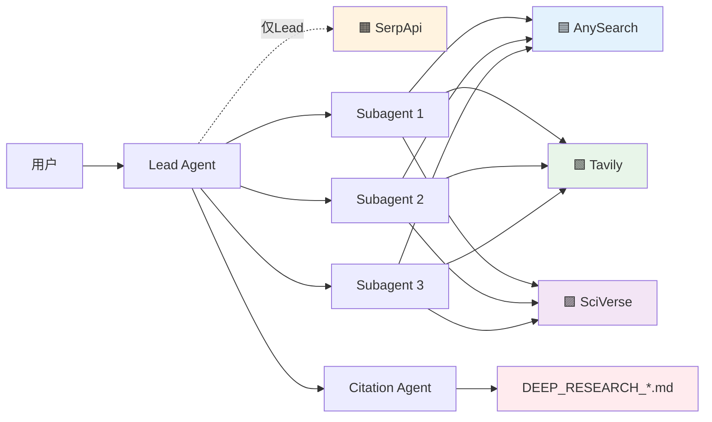

# Tri Research Skill

> **四源并行搜索，深度研究框架。** AnySearch + Tavily + SciVerse + SerpApi，可扩展。

## 🏗️ 架构



## 🚀 安装

```bash
npx skills add jefeerzhang/tri-research-skill
```

## 🎯 触发

```
tri-research <研究问题>
```

**触发词**：`tri-research` / `多元研究` / `多源研究` / `深度研究` / `研究报告` / `全面分析` / `文献综述` / `对比分析`

## ⏰ 时间范围

| 输入 | 范围 |
|------|------|
| （无时间词） | 全部 |
| `2024年研究` | 2024 |
| `近5年进展` | 最近5年 |
| `2020年前` | ≤2020 |

## 🛡️ 降级

每次研究开始前自动检测工具可用性，建议配置但不阻断。

## 🌍 跨平台

支持 Claude Code / Hermes Agent / Codex / OpenCode（详见仓库根 README）

## 🔗 父级 README

完整说明见 [tri-research-skill/README.md](https://github.com/jefeerzhang/tri-research-skill)
